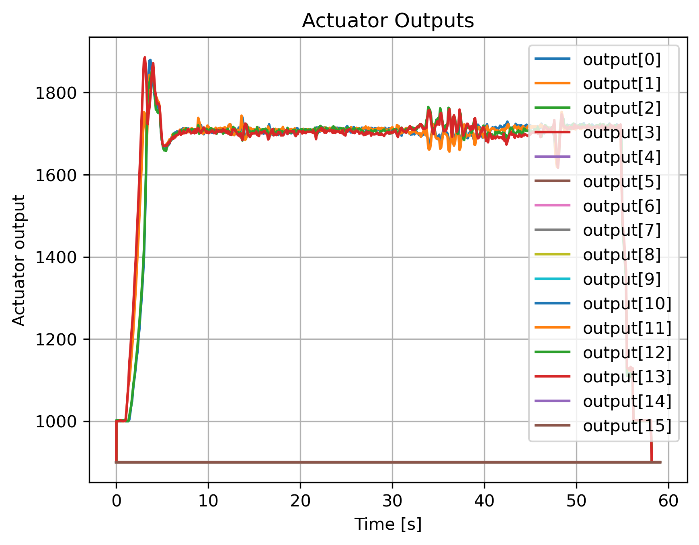
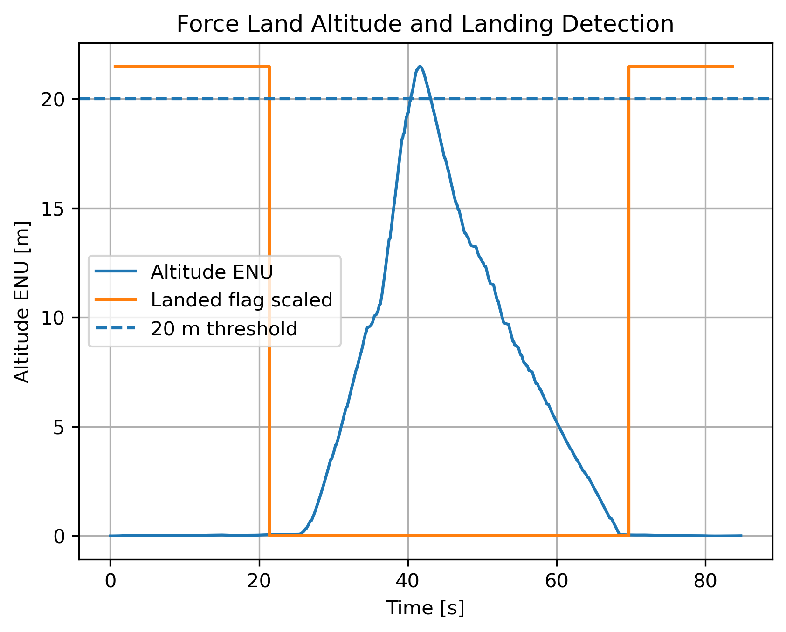
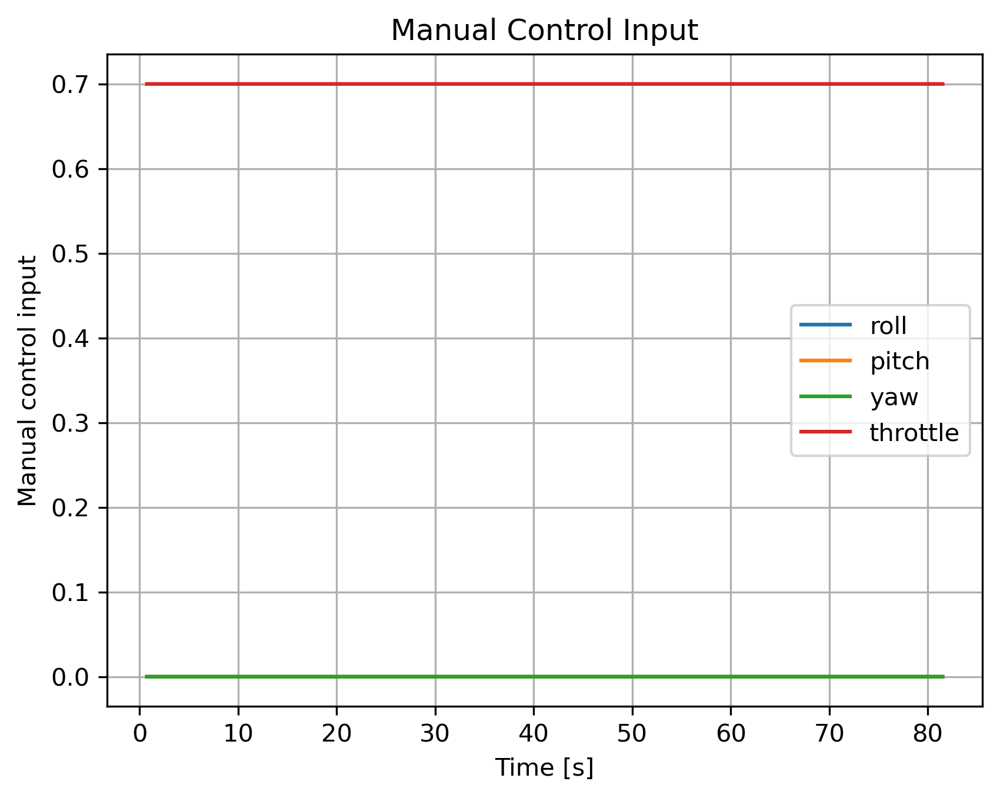
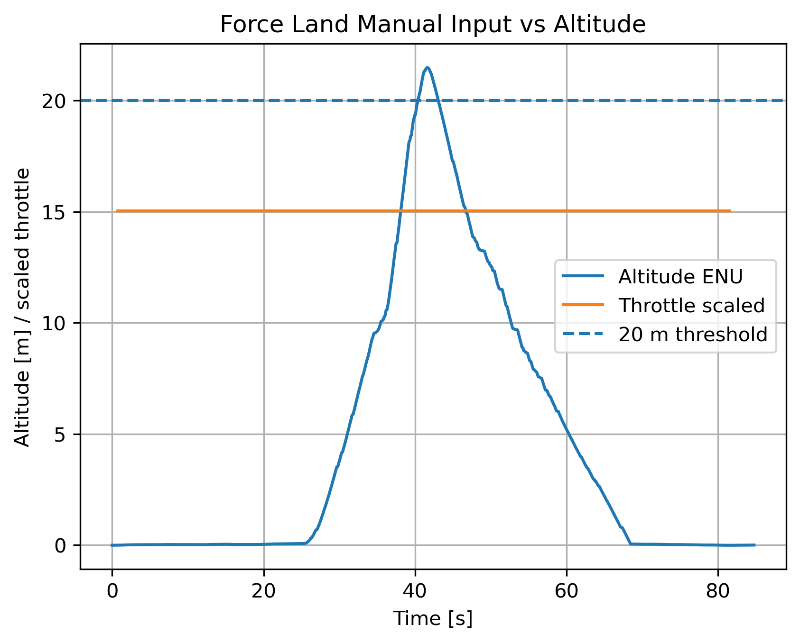
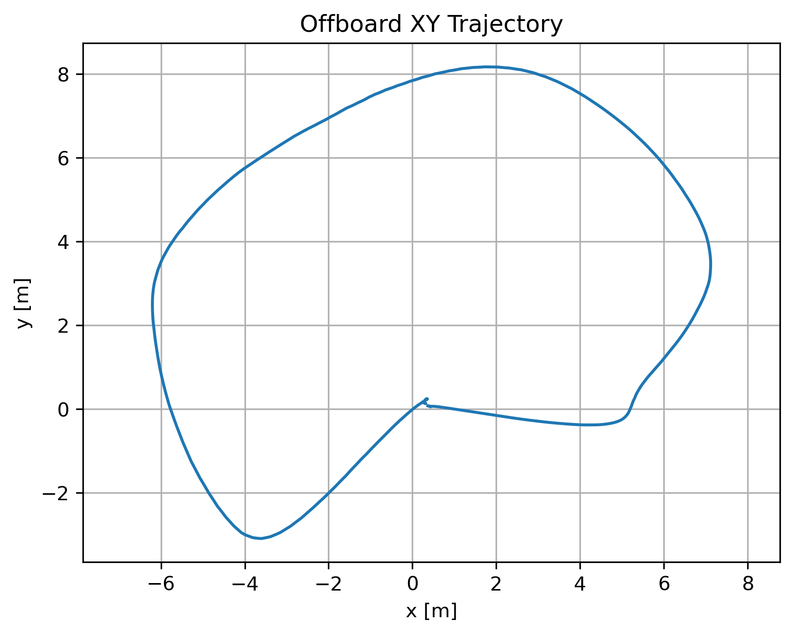
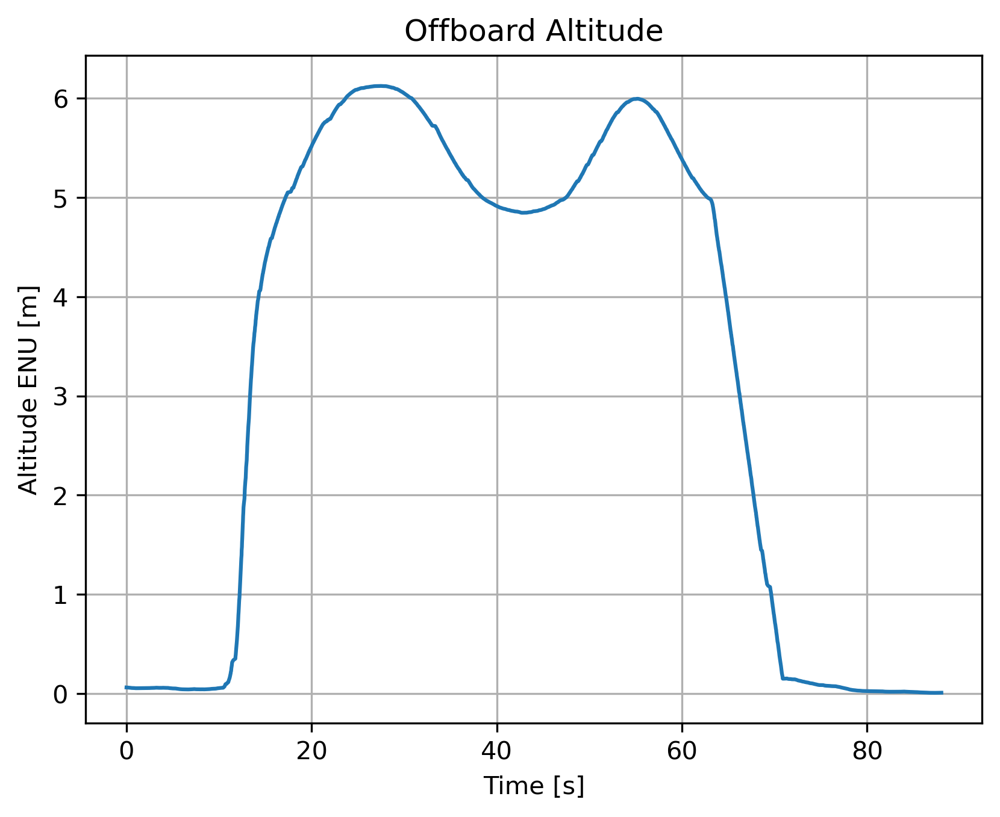
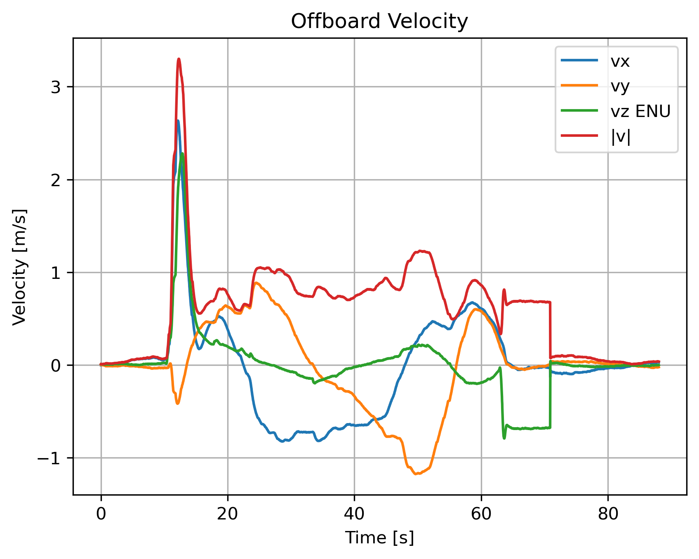
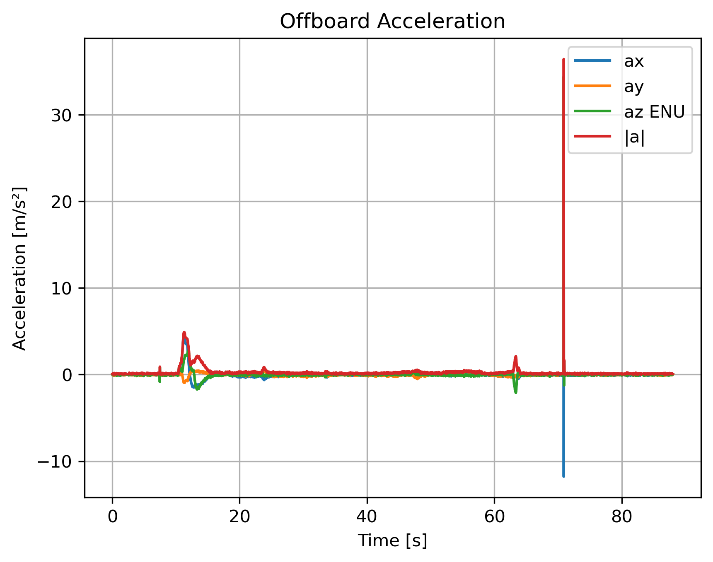
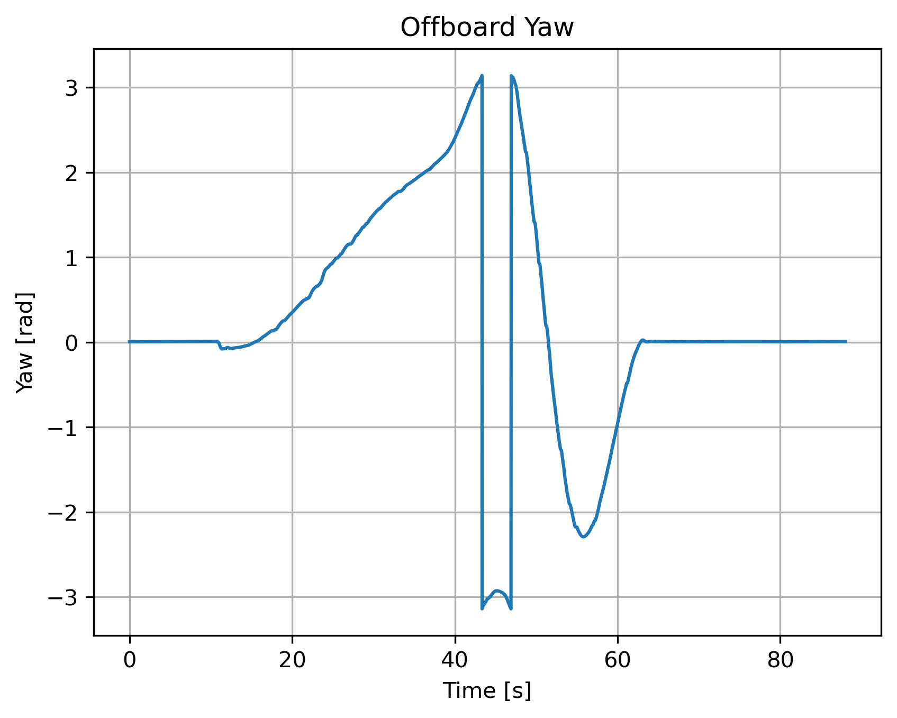

# Robotics Lab 2025 - Homework 3

## PX4 UAV Simulation, Force-Land Safety Logic, and Offboard Trajectory Planning

**Student:** Kishu  
**Course:** Robotics Lab 2025  
**Instructor:** Prof. Mario Selvaggio  
**Submission Date:** June 2026

---

# 1. Project Overview

This homework focuses on PX4-based UAV simulation using ROS 2 and Gazebo.

The project includes:

- PX4 SITL simulation
- Custom UAV validation
- Force-Land safety implementation
- Offboard waypoint navigation
- ROS 2 bag recording
- Flight data analysis
- Result visualization

Software stack:

- PX4 Autopilot
- ROS 2 Humble
- Gazebo Classic
- Micro XRCE-DDS Agent
- Python
- Matplotlib
- ROS 2 Bag

---

# 2. Repository Structure

PX4-Autopilot/

ros2_ws/
  src/
    force_land/
    offboard_rl/
    read_rpy/

plots/

bags/

Main ROS 2 packages:

- force_land: modified force-land FSM node
- offboard_rl: offboard trajectory planner
- read_rpy: attitude reader and logging utilities

---

# 3. Custom UAV Validation

The custom quadrotor vehicle was successfully simulated inside PX4 SITL.

Actuator outputs were extracted from PX4 logs and analyzed to verify motor behavior during:

- Arming
- Takeoff
- Hover
- Waypoint tracking
- Landing

## Figure 1 - Actuator Outputs

The actuator outputs show normal motor arming behavior and stable thrust generation during flight. Motor commands increase during takeoff, remain stable during waypoint tracking, and decrease during landing.

---

# 4. Force-Land Safety Logic

A safety mechanism was implemented to automatically trigger landing when the UAV altitude exceeds 20 meters.

Condition:

Altitude > 20 m

When this condition becomes true:

- Force-land mode is activated
- Landing sequence starts automatically
- Vehicle descends until touchdown

The modified node uses a finite-state machine approach. Once the threshold is exceeded, a landing command is sent and the state changes to landing. The landing procedure is considered complete only when PX4 reports touchdown through the VehicleLandDetected message. This prevents re-triggering the landing logic while the vehicle is already performing a landing maneuver.

## Figure 2 - Force Land Altitude and Landing Detection

The UAV climbs above the 20 m threshold and the force-land logic is triggered. The landing detector confirms successful touchdown at the end of the mission.

## Figure 3 - Manual Control Input

The recorded manual control input remains constant during the experiment. Throttle is maintained while roll, pitch, and yaw remain close to zero.

## Figure 4 - Manual Input vs Altitude

This figure compares throttle input and altitude evolution. The altitude increases until the safety threshold is reached, after which the force-land procedure starts.

---

# 5. Offboard Trajectory Planning

An autonomous offboard controller was implemented using ROS 2.

The UAV follows a trajectory containing more than seven waypoints while maintaining continuous motion throughout the path.

The trajectory planner uses Catmull-Rom spline interpolation to guarantee smooth transitions between waypoints. Position, velocity, acceleration, yaw, and yaw rate references are continuously generated and transmitted to PX4 through the Offboard interface.

Example waypoint sequence:

- (0, 0, 5)
- (5, 0, 5)
- (7, 4, 6)
- (3, 8, 6)
- (-2, 7, 5)
- (-6, 3, 5)
- (-4, -3, 6)
- (0, 0, 5)

The vehicle is commanded with:

- Position setpoints
- Velocity setpoints
- Acceleration setpoints
- Yaw references
- Yaw-rate references

Zero velocity is commanded only at the final waypoint, satisfying the assignment requirement that the UAV must not stop at intermediate waypoints.

## Figure 5 - XY Trajectory

The UAV successfully follows the desired waypoint sequence and returns near the starting location.

## Figure 6 - Altitude Tracking

The altitude remains close to the desired flight level during navigation and decreases smoothly during landing.

## Figure 7 - Velocity Profile

Velocity components vary according to waypoint transitions. Peaks correspond to trajectory changes and turning maneuvers.

## Figure 8 - Acceleration Profile

Acceleration remains bounded during most of the mission. Short peaks appear during aggressive trajectory transitions and landing initiation.

## Figure 9 - Yaw Evolution

Yaw changes continuously during the mission to align the UAV heading with the desired trajectory direction.

---

# 6. Experimental Results

The simulation results demonstrate:

- Successful arming procedure
- Stable takeoff
- Autonomous waypoint navigation
- Correct offboard operation
- Stable actuator behavior
- Automatic force-land activation
- Successful landing detection
- Reliable ROS 2 bag recording
- Smooth spline-based trajectory tracking

The recorded flight data confirms that all required PX4 subsystems operated correctly throughout the experiments.

---

# 7. Results Analysis

Analysis of the generated plots shows that the UAV maintained stable flight during all mission phases.

The actuator outputs remained balanced, indicating proper control allocation and thrust generation.

The force-land experiment confirms that the safety logic is triggered when the altitude threshold is exceeded. The landing detector correctly identifies touchdown and terminates the landing sequence.

The trajectory tracking results show smooth position evolution, bounded acceleration, continuous velocity profiles, and gradual yaw transitions. The UAV never stops at intermediate waypoints, satisfying the assignment requirements.

Overall, the generated data demonstrates stable control performance, successful mission execution, and correct integration between ROS 2 and PX4.

---

# 8. Conclusion

Homework 3 was successfully completed using PX4 SITL, Gazebo, and ROS 2.

A multi-waypoint offboard trajectory planner was implemented and validated. The UAV autonomously tracked the desired trajectory while maintaining smooth velocity and acceleration profiles.

Additionally, the force-land safety mechanism was modified and tested. Experimental results confirmed correct activation of the landing procedure and proper touchdown detection.

All requested plots were generated from recorded flight data and demonstrate successful completion of the assignment objectives.
